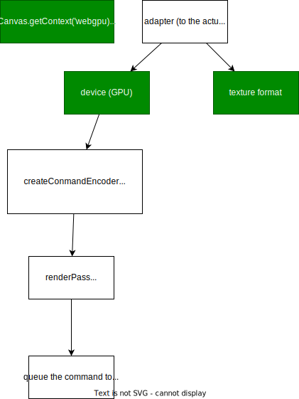
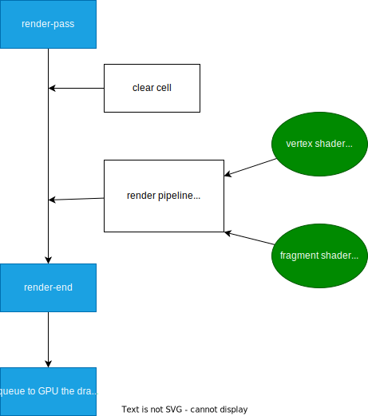

# Objective
- Just playaround with WebGPU

[Project urls](https://jasonlhy.github.io/webgpu-game-of-life/)

## Diagrams
High level:

Render:

## Resource
[Codelab](https://codelabs.developers.google.com/your-first-webgpu-app#3)

[Youtube](https://www.youtube.com/watch?v=m6T-Mq1BPXg)